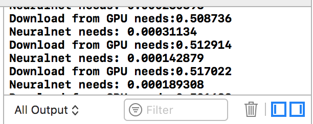

# tiny-yolo-opencv-opencl-implementation

I have tried to implement the tiny yolo with opencl in opencv to run on my Mac.
The neural net run very fast, but there is one problem.
The download from the GPU to the CPU need 0.5 seconds.
I have tried a .weights file with only 1 class.
After that problem I have stopped the project.
I hope one of you has an idea to solve this problem.

## Screenshot:

#Changes
To add opencv in XCode, you need openCV 3.

* Add libopencv_….dylib
* Add opencl.framework
* Header search path
* Library search path
* Other linker flags
* Edit Scheme -> Run -> Options -> Edit working directory
   /…/…/tiny-yolo-opencv-opencl-implementation/tiny-yolo-opencv-opencl-implementation
